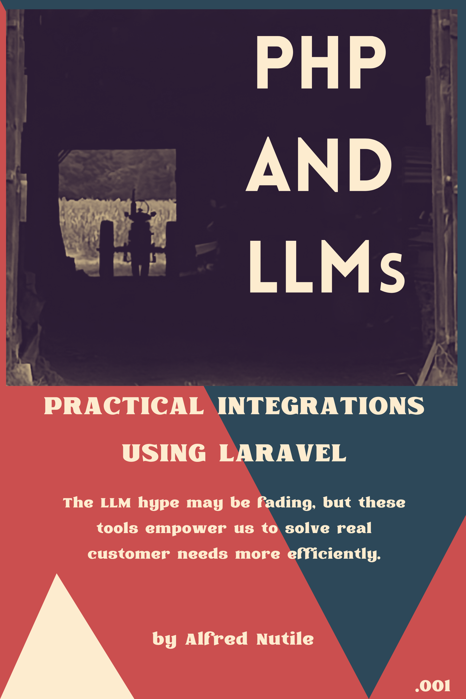

# PHP and LLMs

See the sample with two complete chapters
[PHP and LLMs](https://bit.ly/php_llms_sample)

## About the Book

This book is a practical guide for PHP developers navigating the rapidly evolving landscape of Large Language Models (LLMs). Moving beyond the hype, it delves into real-world applications and solutions, providing step-by-step instructions on how to integrate LLMs into your existing projects.

From mastering prompts to building reusable tools and working with various LLMs, this book equips you with the skills needed to leverage the power of Ai in everyday development tasks.

Whether you’re looking to automate complex workflows, enhance content verification, or simply stay ahead in a changing industry, this book offers the insights and hands-on examples to get you there. This isn’t just another “Hello World” guide—it’s a deep dive into the future of PHP development, focusing on real solutions that drive real results.

## Learn More 

[LeanPub Books](https://bit.ly/php_llms)
